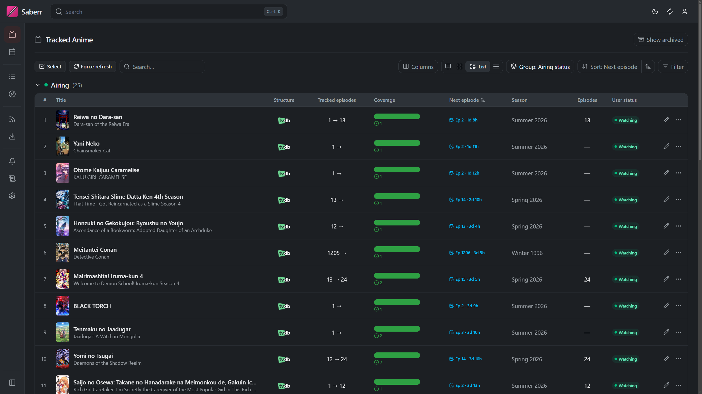
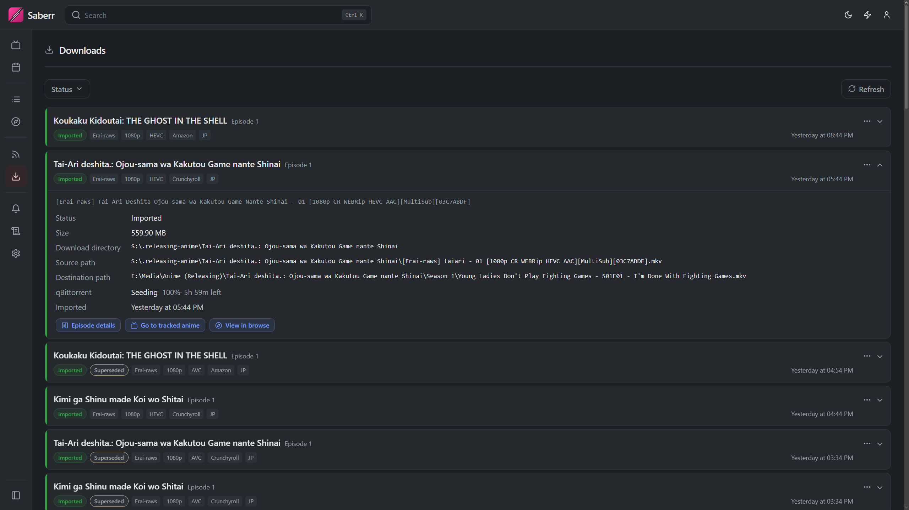
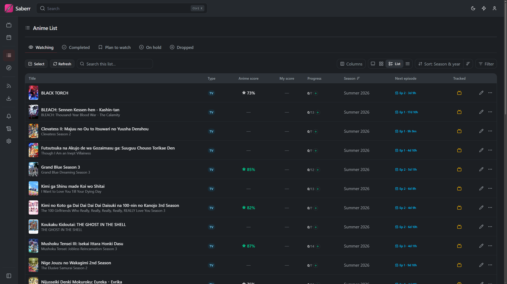
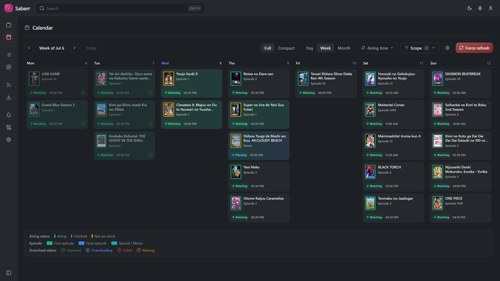
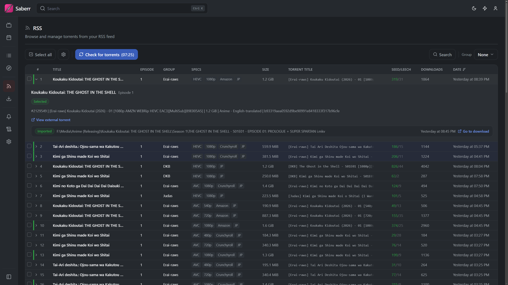
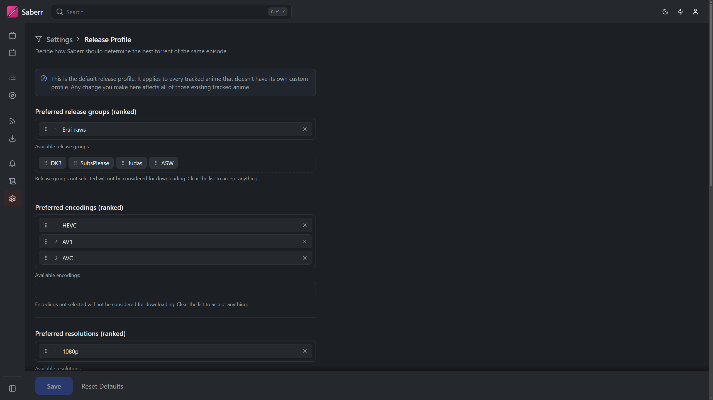
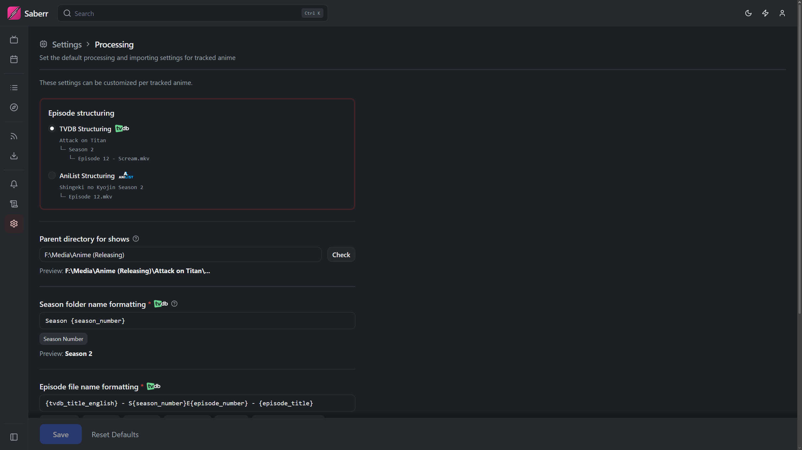

  

---

Saberr is a seasonal anime library management system, designed to give the user a hands-off approach to downloading and
structuring anime shows into their TVDB-structured media library.

Essentially, Saberr is heavily inspired by [Sonarr](https://github.com/sonarr/sonarr) and
[Taiga](https://github.com/erengy/taiga), and aims to bridge the gap between them. Sonarr has little to no awareness of
how anime shows are released, and Taiga has no awareness of the modern media library structure. Saberr takes the best of
both worlds and gives every anime show and episode a clear destination in your media library.

## Features

- **Tracks the shows you're watching.**
- **Watches Nyaa RSS feeds and parses release titles (group, resolution, episode, batch, etc.)**
- **Picks the best release per show against a quality profile you set.**
- **Hands the download off to qBittorrent, then renames and copies the result into a TVDB-aware library layout.**
- **Maps AniList episodes to TVDB seasons/episodes**, including the split-cour and absolute-numbering cases that usually
  need manual fixing, with per-show overrides when the automatic mapping is missing (or wrong).
- **Notifies you on Discord when something is imported.**

Other features:

- **In-app AniList list management and integration** (support for other list trackers like MAL coming soon™).
- **Ability to browse anime by season, as well as view the release calendar for shows you're tracking and/or watching**.

---

An example lifecycle of an episode

1. A new episode of a show you're watching is released: `[SubsPlease] Dr. Stone S4 - 37 (1080p) [477E9A74].mkv`.
2. Saberr will detect Dr. Stone as the anime, and will figure out that episode 37 is part 3 episode 13.
3. Saberr will be able to map this episode to TVDB season 4, episode 37 and will retrieve its metadata.
4. The new release will then be copied into its designated directory using the conventional media library filename
   format: `Dr. Stone/Season 4/Dr. Stone - S04E37 - Ushers of an Exhilarating Future.mkv`.

Of course none of this is strict, as there are plenty of customizations that can be applied to how detection, mapping,
structuring and formatting can happen.

## Screenshots

<table>
  <tr>
    <td>
      
    </td>
    <td>
      
    </td>
  </tr>
</table>

More screenshots

<table>
  <tr>
    <td>
      
    </td>
    <td>
      
    </td>
  </tr>
  <tr>
    <td>
      
    </td>
    <td>
      
    </td>
  </tr>
  <tr>
    <td>
      
    </td>
    <td>
      
    </td>
  </tr>
</table>

## Prerequisites

Required for functionality:

* **A torrent client (only qBittorrent is supported for now)**
* **An internet connection** (duh)

Recommended for better integration and experience:

* An AniList account.
* A Discord channel for sending new release notifications.

## Installation

There are currently 2 ways to install Saberr on your system: an installer (Windows), and docker.

### Docker

A [docker-compose.yaml](docker-compose.yaml) is included and runs both the app and its MariaDB database, and comes
shipped with the dashboard UI.

Before using it, read the [guide and instructions](guides/DOCKER.md) carefully to avoid misconfigurations.

### Windows

Grab the installer from the [releases page](https://github.com/saberr-app/saberr/releases). It's a fully self-contained
build: bundled Python runtime, MariaDB, the dashboard and the tray app. It runs from the system tray and lets you set
the admin password through the first-time setup.

The dashboard is accessible by default at `http://localhost:8125`.

## Support

* File an issue for any bugs or unexpected behavior.
* Join the [Discord server](https://discord.gg/3X2e7vgua4) for discussions, help, updates, and everything else.

## Roadmap

In no particular order or priority:

* Add support for more list trackers (MAL, Kitsu).
* Add support for more torrent clients.
* Generic torrent title parsing and getting rid of the limited set of allowed release groups.
* Dynamic RSS feeds.
* Batch torrents support.
* Library detection and monitoring (with the end goal of mirroring Sonarr's library management).

## Attributions

Saberr uses Taiga's [anime-relations](https://github.com/erengy/anime-relations) to resolve the target anime from
torrent titles through episode number offset, and
AniBridge's [mappings](https://github.com/anibridge/anibridge-mappings) to map anime episodes to TVDB episodes
automatically.

## AI Disclaimer

Generative AI tools are used to assist in the development of this app as described below:

* All of the unit tests are written by AI with some guidance.
* Scripts such as the nuitka build script and the Inno setup script are entirely written by AI with some intervention
  and guidance.
* API components, connecting API endpoints with business logic (mostly for DTO/ORM to pydantic mapping), are partly
  written by AI.
* The remaining code in this repo is +95% human, with the remaining 5% being misc helpers here and there.
* Dashboard UI ([Saberr UI](https://github.com/saberr-app/saberr-ui)) is almost entirely designed and written by AI
  with strict guidance.

## License

Saberr is free software: you can redistribute it and/or modify it under the terms of the **GNU Affero General Public
License** as published by the Free Software Foundation, either version 3 of the License, or (at your option) any later
version.

It is distributed in the hope that it will be useful, but **without any warranty**; without even the implied warranty of
merchantability or fitness for a particular purpose. See the [LICENSE](LICENSE) file for the full terms.
